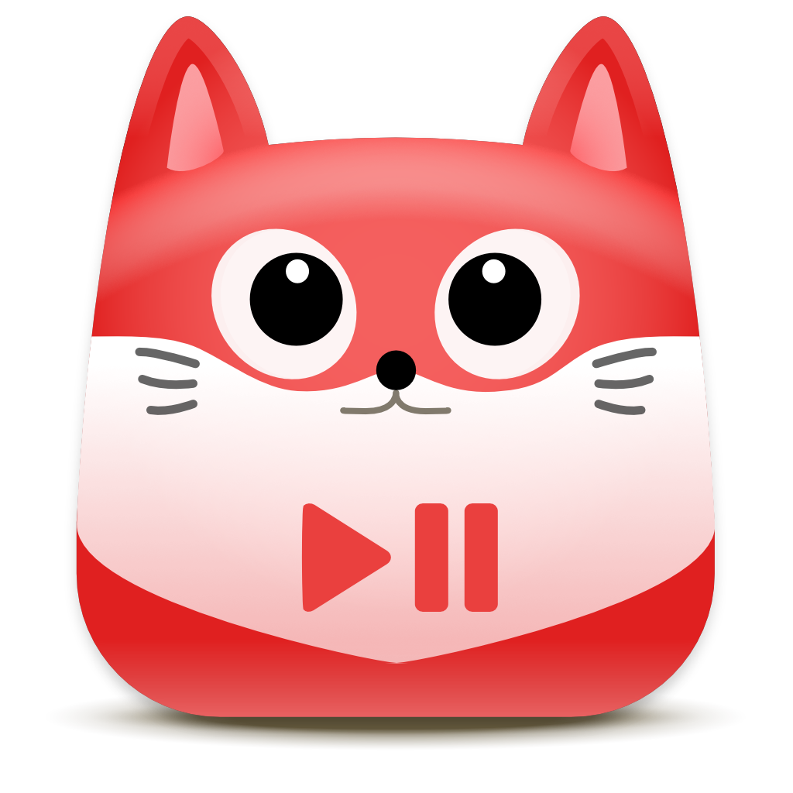

[go-musicfox](https://github.com/anhoder/go-musicfox) Icon
======================

<p float="left">
	
</p>

[go-musicfox](https://github.com/anhoder/go-musicfox) Icon. Based on [kitty-icon](https://github.com/DinkDonk/kitty-icon).

### Building

Requires [node](https://nodejs.org/en/) and [npx](https://www.npmjs.com/package/npx).

```bash
$ make
```
